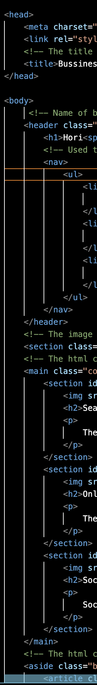
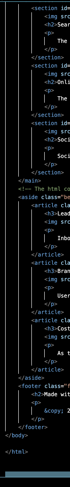
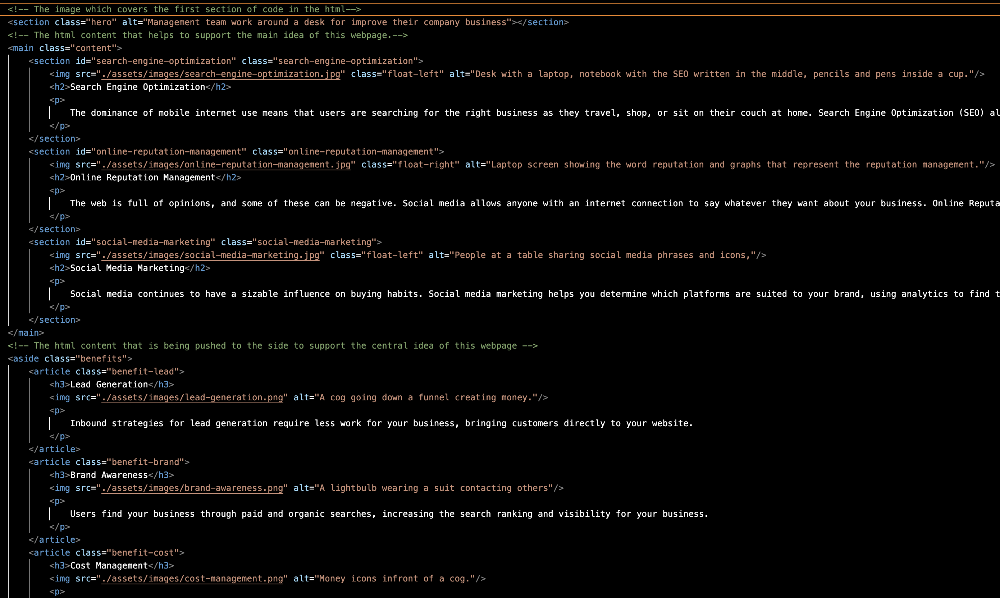
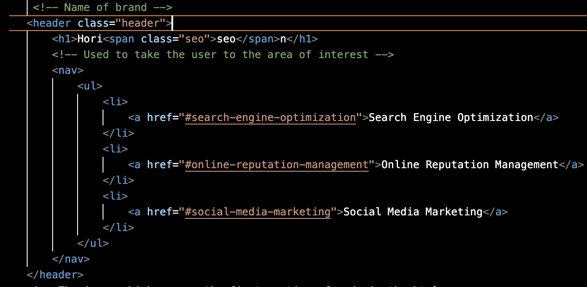
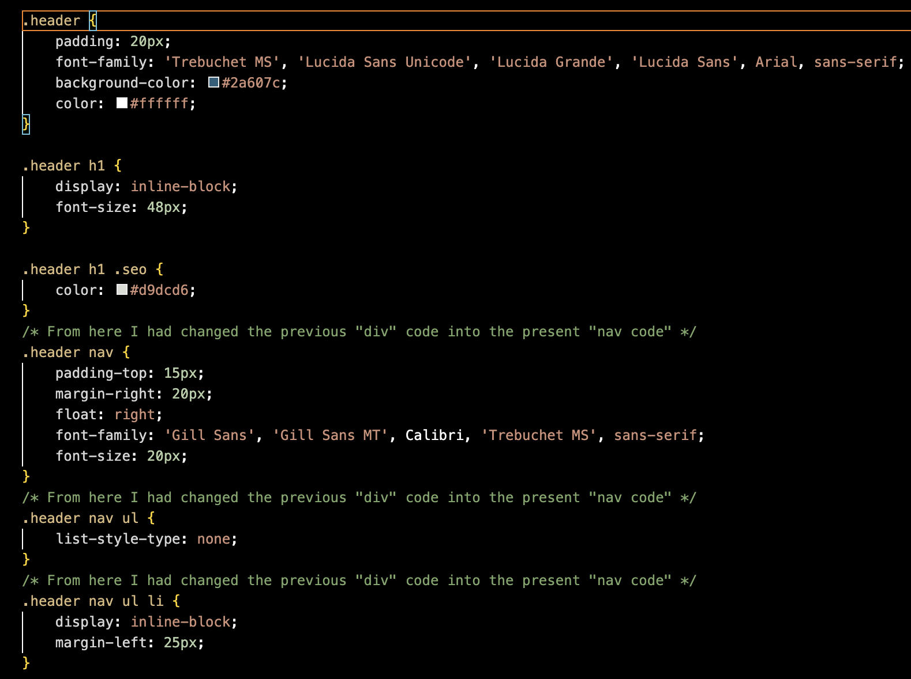
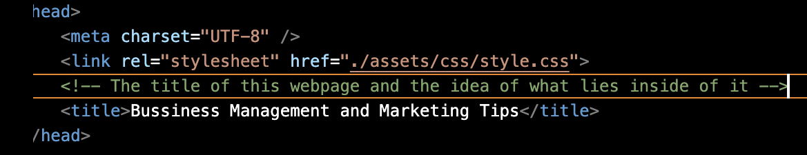

# Website-Accessibility 
Objective: Step 1 make webpage semantic HTML elements, step 2 make HTML elements follow a logical structure, step 3 alt attributes to images, step 4 make heading attributs fall into sequential order, and step 5 make a consie, descriptive title.
## Step 1 and 2

Here you can see that this HTML file contains semantic elements as well as follows a logical structure.

## Step 3

In this image you are able to see the alt attribute being applied to help with accessability standards, to help describe the image being shown.

## Step 4

In these screenshots you can see that the heading code falls into sequential order.

## Step 5

In this image you are able to see the title i have given to this webpage to describe the contents within the webpage.
